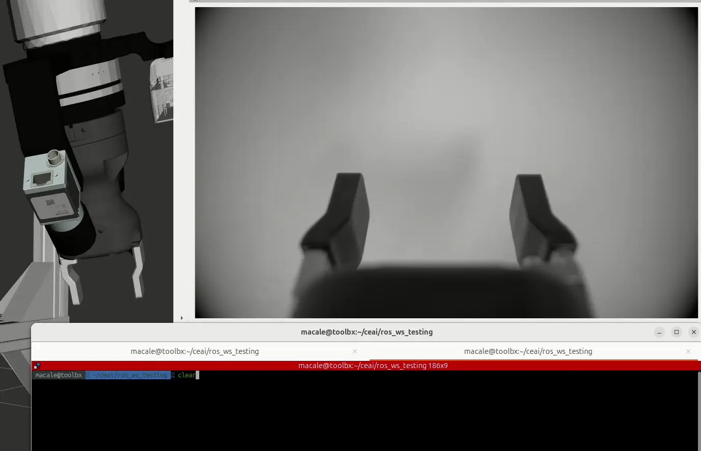

# robotiq_hande_driver

[](https://opensource.org/licenses/Apache-2.0)
[](https://github.com/pre-commit/pre-commit)
[](https://doi.org/10.5281/zenodo.15047949)

Package for controlling the [Robotiq Hand-E gripper](https://robotiq.com/products/adaptive-grippers#Hand-E) using the [ROS 2 Control](https://control.ros.org/jazzy/doc/getting_started/getting_started.html) framework. It uses the [robotiq_hande_description](https://github.com/AGH-CEAI/robotiq_hande_description) package for URDF definitions. Originally developed for integration with Universal Robots e-Series (UR5e) and ROS 2 Humble, it is possible to modify this repository to fit your needs. **PRs are welcome!**




---

## Quick Start

### Workspace setup

```bash
mkdir -p ~/ceai_ws
cd ~/ceai_ws
git clone git@github.com:AGH-CEAI/robotiq_hande_driver.git src/robotiq_hande_driver
vcs import src < src/robotiq_hande_driver/robotiq_hande_driver/robotiq_hande_driver.repos
colcon build --symlink-install
source ./install/local_setup.sh
```
> [!NOTE]
> **Configuration is split between two packages:**
> * `robotiq_hande_description`: Hardware connection parameters are set in the URDF file. [Example config file](https://github.com/AGH-CEAI/robotiq_hande_description/blob/jazzy/urdf/robotiq_hande_gripper.urdf.xacro).
> * `robotiq_hande_driver`: The controller configuration is set by launch parameters for the `controller_node`. [Example config file](robotiq_hande_driver/bringup/config/hande_controller.yaml).


### Launch preview

Start the driver:
```bash
ros2 launch robotiq_hande_driver gripper_controller_preview.launch.py use_fake_hardware:=true
```

Send a command to the gripper in another terminal:
```bash
ros2 action send_goal /gripper_action_controller/gripper_cmd control_msgs/action/ParallelGripperCommand \
"command:
  header:
    stamp:
      sec: 0
      nanosec: 0
    frame_id: ''
  name: []
  position: [0.0]
  velocity: []
  effort: []
"

```

## Connection modes

You can run the gripper in three ways.

### Without the physical hardware

If you only want to test the gripper behavior or visualize it in RViz without connecting to the actual device, you can use the fake hardware mode. In this case, simply pass the `use_fake_hardware:=true` argument:
```bash
ros2 launch robotiq_hande_driver gripper_controller_preview.launch.py use_fake_hardware:=true
```

All other connection options will be ignored; this mode does not communicate with any physical port or network but simulates responses and allows the controller to run.

### Modbus RTU

If you want to work with the real gripper via direct serial communication, the computer connects to the gripper through a USB-to-RS485 adapter. The wiring is represented as:

Computer → USB adapter ↔ RS485 ↔ Hand-E gripper

In this case, you need to set `use_fake_hardware:=false` and provide serial port to establish connection using `tty_port`:
```bash
ros2 launch robotiq_hande_driver gripper_controller_preview.launch.py use_fake_hardware:=false tty_port:=/dev/ttyUSB0
```

You can check available serial devices with:
```bash
dmesg | grep tty
```

or

```bash
ls -l /dev/tty*
```

Make sure your user has permissions to access the serial port:
```bash
sudo usermod -a -G dialout $USER
```

### Modbus RTU tunneled over TCP via UR Tool Communication

If your setup involves a UR robot, its controller can expose the RS-485 tool port over TCP using the pTool Communication URCap](https://docs.universal-robots.com/Universal_Robots_ROS2_Documentation/doc/ur_robot_driver/ur_robot_driver/doc/setup_tool_communication.html). The wiring is represented as:

UR controller RS-485 tool port ↔ URCap forwarder ↔ TCP socket ↔ Computer

Although this is a TCP connection, the driver uses a pseudo-TTY to translate TCP packets into RTU frames. Typically, the virtual serial port is `/tmp/ttyUR`.

To enable this mode, set `use_fake_hardware:=false`, `create_socat_tty:=true`, and specify the `socat_ip_address` and `socat_port` of the UR forwarder:
```bash
ros2 launch robotiq_hande_driver gripper_controller_preview.launch.py \
  use_fake_hardware:=false \
  create_socat_tty:=true \
  tty_port:=/tmp/ttyUR \
  socat_ip_address:=192.168.1.2 \
  socat_port:=54321 \
  frequency_hz:=10 \
  launch_rviz:=true
```

 The driver will then use `tty_port:=/tmp/ttyUR` as if it were a real serial port.

You can also start `socat` manually, for example:
```bash
socat pty,link=/tmp/ttyUR,raw,ignoreeof,waitslave tcp:192.168.100.10:54321
```

> [!WARNING]
> Do not use both the `use_tool_communication:=true` flag for the **ur_driver** and the `create_socat_tty:=true` flag for the **robotiq_hande_driver**!
> Both options will invoke the `socat` command to create the `/tmp/ttyUR` virtual serial port.
> However, the initialization of the Hand-E driver may suffer from a race condition: **the tty link must exist before initialization**.
> It is recommended to use the provided `create_socat_tty` option.

## Integration with (other) robots

To integrate the Robotiq Hand-E gripper into your existing robot, you first need to create a [Xacro (URDF) file](https://docs.ros.org/en/jazzy/Tutorials/Intermediate/URDF/URDF-Main.html) that includes the Hand-E macros and defines all necessary parameters.

A working example of such a file can be found [here](https://github.com/AGH-CEAI/aegis_ros/blob/jazzy-devel/aegis_description/urdf/modules/robotiq_hande_gripper.xacro). You can use this file as a starting point for your own integration.

Next, include this Xacro file in your main robot description tree at the appropriate tool link.

An example of including it in a robot Xacro can be found [here](https://github.com/AGH-CEAI/aegis_ros/blob/jazzy-devel/aegis_description/urdf/aegis.xacro).

The included robotiq_hande_gripper macro automatically sets up the `<ros2_control>` block pointing to the Robotiq Hand-E driver plugin. This ensures that your robot can control the gripper via the standard ROS 2 control interfaces.

You can easliy dig into the `ros2_control` concepts with [its documentation](https://control.ros.org/jazzy/doc/ros2_control/doc/index.html#concepts). There is also a [plenty of examples](https://control.ros.org/jazzy/doc/ros2_control_demos/doc/index.html#examples)

> [!IMPORTANT]
> The `robotiq_hande_driver` currently provides only a **hardware component** (i.e. _hardware interface_) to control the fingers' joints.

The included `robotiq_hande_gripper` macro automatically sets up the `<ros2_control>` block pointing to the Robotiq Hand-E driver plugin. This ensures that your robot can control the gripper via the standard ROS 2 control interfaces, including the gripper action controller and joint state broadcaster, without additional manual plugin configuration.

---
## Development notes

This project uses various tools for aiding the quality of the source code. Currently most of them are executed by the `pre-commit`. Please make sure to enable its hooks:

```bash
pre-commit install
```

### Test Serial Connection

There is an additional test tool with hardcoded parameters to test the connection with the Hand-E without any ROS dependencies.
Before build, change the hardcoded parameters in the beginning of the `robotiq_hande_driver/test/communication_test.cpp` file.

To run test:
```bash
cd ~/ceai/ros_ws/build/robotiq_hande_driver
./communication_test
```

---
## License

This repository is licensed under the Apache 2.0, see LICENSE for details.
